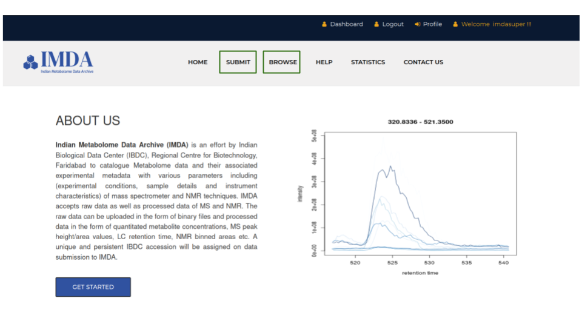
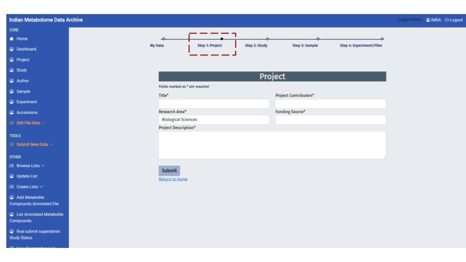
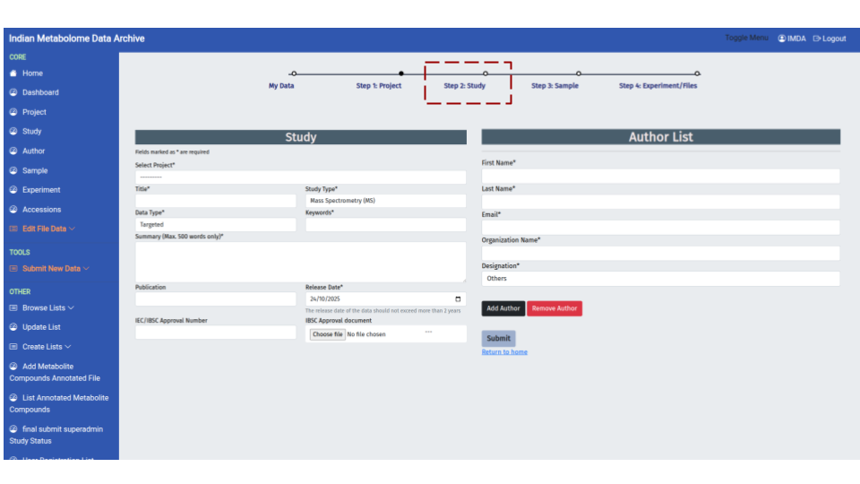
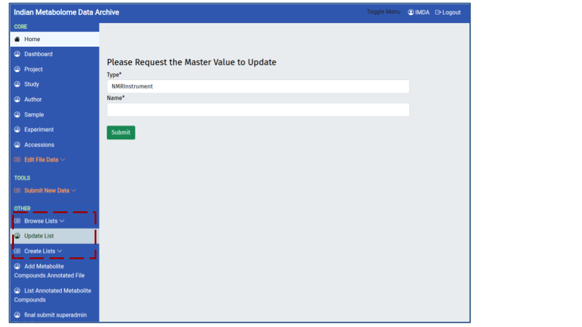
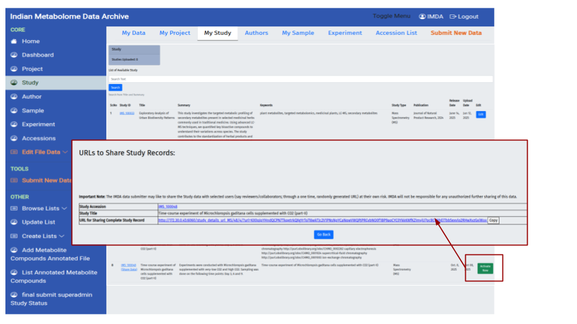

# Submission Prerequisites Checklist

!!! tip "Mandatory Pre-Submission Preparation"
    Before beginning the four-part deposition process, ensure the following critical tasks are completed to prevent upload errors and delays during curation:

    ### Data and File Preparation
    * **File Integrity (MD5):** Make ready your raw/derived data files. **All complex raw data folders must be compressed into individual ZIP archives** before transfer. Generating an **MD5 Checksum** for each ZIP file is mandatory (See 3.0).
    * **Filename Compliance:** Ensure all raw and derived data files only contain letters (a-z, A-Z), numbers (0-9), hyphens (-), underscores (_), or dots (.). **Spaces and special characters are NOT accepted.**
    * **Data Structure:** Organize your raw data within logical, clean subfolders on your local storage before compression.
    * **FTP Tool:** Install an FTP client (e.g., FileZilla) if you plan to upload large files in bulk.

    ### User and Metadata Requirements
    * **User Account:** Create your IMDA user account if you do not have one (See 1.1).
    * **Attribution:** Collect the contact information (name, email, affiliation) for the Principal Investigator (PI) and all contributing authors.
    * **Required Documentation:** Prepare a Summary, Keywords, and any relevant publication or ethical approval numbers (e.g., IBSC/IEC Approval).

---

## Part 1: Initial Access & Setup

### 1.0 Primary Navigation

The IMDA portal's landing page provides immediate access to the two core functions: **data submission** and **data retrieval**.

| Option | User Action & Location | Purpose |
| :--- | :--- | :--- |
| **Submit** | **Click this button** to begin a fresh submission. | Initiates the comprehensive, multi-step **Study Deposition Pipeline**. |
| **Browse data** | **Click this tab** to search, view, and download studies. | Enables **data retrieval**, **searchability**, and access to the repository. |

> **Note:** The entire submission workflow detailed in this SOP begins with selecting the **'Submit'** option.

### 1.1 User Registration

Before submitting data, you must establish a personal account. **User Registration** links your identity to the data, which is essential for final attribution.

**Action:** Locate the **'User Register'** option and proceed to the account creation form.

* **Instruction:** **Fill in all mandatory fields** (marked with an asterisk).

### 1.2 User Login

Login initiates a secure, authenticated session, protecting sensitive pre-publication data.

**Action:** Enter your credentials on the login page.

* **Security:** Note that sessions may time out for security purposes, requiring you to log back in.

---

## Part 2: Required Study Metadata

### 2.0 Project Registration

The first metadata form encountered is **Project Registration** (Step 1 in the top workflow diagram). This step establishes the **high-level administrative umbrella** for your data. A Project can contain one or more related **Studies**.

**Purpose:** To define the overall research initiative, funding source, and main investigators responsible for the data.

| Required Field | Importance |
| :--- | :--- |
| **Title*** | A concise name for the overall research effort or consortium. |
| **Project Contributors*** | Lists all key individuals involved in the project. |
| **Research Area*** | Categorizes the scientific domain (e.g., Biological Sciences). |
| **Funding Source*** | **Crucial for compliance.** Tracks the grant or funding body that supported the data generation. |
| **Project Description*** | A detailed summary of the overarching goal or scope of the data collection effort. |

**Final Action:**

1.  Fill in all fields marked with an asterisk (\*) as they are mandatory.
2.  Provide accurate information for the **Funding Source**, as this is essential for accountability.
3.  Click **Submit**. The system will assign a unique **Project Identifier**.

!!! tip "Project vs. Study"
    The **Project** defines the *'Who' and 'Why'* (the group and the grant). The **Study** (Step 2) defines the *'What' (the specific experiment).

### 2.1 Study Registration
This form is essential for defining the **scientific context** and **experimental design** of your data. The information provided here links your study to the larger Project and is crucial for accurate data indexing and searching.

**Workflow Action:** After successfully completing Project Registration, you will select that **Project ID** and then fill out the **Study Details** and **Author List** sections.

#### Study Details Section

| Required Field | Relevance & Purpose |
| :--- | :--- |
| **Title*** | The concise, descriptive title of the specific experiment. |
| **Study Type*** | Defines the analytical technology used (e.g., Mass Spectrometry (MS) or NMR). |
| **Data Type / Summary** | Specifies the scope (Targeted or Untargeted) and provides a brief abstract (max 500 words) of the findings. |
| **Release Date*** | **Mandatory.** The date your data will become publicly available. |
| **Publication / Approval** | Links the study to its **DOI** or references the necessary ethical/institutional approval numbers (IEC/IBSC). |

#### Author List Section

* **Action:** Click **'Add Author'** to include all contributing authors. Ensure all names, emails, and affiliations are correct, as this determines final data attribution.

**Final Action:** Click **Submit**. Upon success, your study will be assigned a **permanent Study ID** (e.g., **IMS\_XXXXX**), which will be used for all tracking and citation purposes. The workflow will then proceed to **Step 3: Sample**.

### 2.2 Sample Registration 

This is **Step 3: Sample** in the submission workflow. Here, you capture detailed **metadata** describing each biological sample, ensuring the **biological context** is fully recorded for data reuse.

**Purpose:** To define the exact origin, source, and classification of all samples (e.g., organism, tissue type, treatment received).

**Action:** You will provide the sample details primarily through an uploaded template file.

| Required Field (Form) | Importance for Data Reusability |
| :--- | :--- |
| **Select Study*** | Links the sample details to the **Study ID** (from Step 2) they belong to. |
| **Source*** | The primary origin of the sample (e.g., tissue, cell culture, biofluid). |
| **Organism Name*** | The full name of the organism or species studied. |
| **Taxonomy ID*** | **Highly important.** Uses a standardized numerical identifier for unambiguous classification. |
| **Sample File Template*** | The spreadsheet used to record individual sample treatments and characteristics. |

**Final Action:**
1.  **Download** the **Sample File Template** available on this page and fill it out offline.
2.  **Upload** the completed file using the **Choose File** button under *Sample File Template*.
3.  Click **Submit** to register the sample metadata. The workflow then proceeds to **Step 4: Experiment/Files**.

!!! tip "Taxonomy ID Verification"
    When you enter the **Organism Name**, the system will use an API to **automatically fetch** the corresponding **Taxonomy ID**. Please **cross-check** the fetched ID for accuracy. Using correct IDs is essential for integrating your data with other public repositories.

### 2.3 Experiment Registration

This is **Step 4: Experiment/Files**—the final metadata step detailing the analytical workflow and uploading the processed metabolite data.

* **Key Action: Upload Processed Data:** You are required to upload a **Metabolite / Compound File**. This is the critical processed data summary (listing metabolites, identifiers, and quantification values).
* **Protocol Details:** Use the **Select Technique** dropdown to specify the primary analytical technique (e.g., MS-based, NMR-based).

#### Analytical Template Instructions (MS & NMR)

When filling out the MS File Template and NMR File Template (available for download on this page), please adhere to the following strict rules:

| Template Field Category | Example Columns | Mandatory Rules |
| :--- | :--- | :--- |
| **Mass Spectrometry (MS)** | Mass Spectrometer Type, MS Instrument Name, MS Ionization Method | **Use Dropdown Lists:** Select values from the provided dropdown menus for consistency. |
| **Nuclear Magnetic Resonance (NMR)** | NMR Instrument Name, NMR Type, NMR Solvent | **Do Not Change Headers:** The column headers must **not** be modified. |

---

#### 🔗 Cross-Reference and Data Integrity

It is **critical** to integrate your data file details directly into this template:

1.  **Sample IDs:** Retrieve the **Sample IDs** from the 'My Sample' dashboard and paste them into the **'Sample id'** column of the template.
2.  **MD5 Checksum:** Locate the column dedicated to the **MD5 Checksum** and enter the 32-character hash (calculated in Step 3.0) for the final zipped raw data file. This confirms data integrity.
3.  **Metabolite Annotation:** The **Metabolite / Compound File** must contain, at a minimum: **Metabolite Name**, **SMILES string**, **InChI ID**, and **Quantification Data**.

!!! warning "Template Rules"
    1.  **Do Not Modify Headers:** The template header rows must **never be changed** or deleted.
    2.  **Use Controlled Vocabulary (Dropdowns):** Fill fields by selecting from the provided dropdown options where available.
    3.  **Use 'NA' for Missing Data:** If a column is required but the information is genuinely not applicable to your experiment, you must enter **NA** (Not Applicable).

**Final Action:**
1.  Select the **Technique** and link the **Study**.
2.  Upload your completed and MD5-integrated **Analytical Template File** and the **Metabolite / Compound File**.
3.  Click **Submit**. The process now moves to **Part 3: Data Integrity & Upload** for file transfer.

---

## Part 3: Data Integrity & Upload

### 3.0 Calculate MD5 Checksum 

Generating an **MD5 Checksum** is a vital, mandatory step for **data integrity** validation before file transfer.

**Access the Tool:** [IMDA MD5 Checksum Tool](https://ibdc.dbtindia.gov.in/imda/toolmdchecksum.html).

**Purpose:** The MD5 checksum provides a unique 32-character digital "fingerprint" for your compressed data file. This ensures the file transferred to the server is an exact, unaltered copy of your original data (crucial for reproducibility).

#### Generating the Checksum and Zipping Data

The IMDA provides specialized scripts to automate the compression and checksum calculation process:

1.  **Select Operating System:** On the tool page, click the appropriate link to **Download Script for Windows, macOS, or Linux**.
2.  **Run the Script:** Execute the downloaded script in the directory containing your raw data files.
3.  **Automatic Output:** Upon completion, the script automatically generates a file named **`md5sum.txt`** in the same directory.

!!! success "Integrity File Output"
    The **`md5sum.txt`** file contains the **MD5 hash value** for each zipped folder and the corresponding **filename**. You will use the contents of this file when you map your uploaded files (Step 3.3).

### 3.1 FTP Server Details

This page provides the personalized credentials required to connect to the IMDA server using **SFTP** (Secure File Transfer Protocol).

| Detail | Purpose |
| :--- | :--- |
| **HOSTNAME, USERNAME, PASSWORD** | Confidential credentials for secure file transfer. |
| **Transfer Mode** | Must use **SFTP** for encrypted data transit. |

### 3.2 Using FileZilla (FTP Client) for Upload

Use an SFTP client (like FileZilla) to connect using the details from 3.1 and transfer your zipped data archives to your designated **Study ID** folder.

### 3.3 Map Uploaded Files 

This final step links the physical files you transferred via FTP to the Sample and Assay metadata you created. This page lists all unmapped files available on your server space.

* **Action:** Click the **'Map Uploaded Files'** link on the left menu to access this dashboard.

#### The Mapping and Validation Process

1.  **File List:** Verify that all the files you intended to upload are listed under their correct **Study ID**.
2.  **Mapping Action:** For each file listed, you will link it to the corresponding Sample ID and Protocol, and importantly, **you will input the MD5 Checksum** (calculated in Step 3.0) to prove the transfer was successful.

!!! warning "Final Submission Control (CRITICAL)"
    Once you click **'Validate All Files For This Study'**, the system considers the deposition complete. At this point, the **direct 'Edit' options** (from Step 4.1) on your Project, Study, and Sample dashboards will **DISAPPEAR**. Ensure all metadata is accurate and complete before clicking this button.

**Final Action:** Once all files are mapped and you are 100% certain your metadata is correct, click **'Validate All Files For This Study'**. The process will then move to the **Curation Pipeline**.

---

## Part 4: Post-Submission Management

### 4.0 Check Study Status 

After completing the data mapping (Part 3), your study enters the **Curation Pipeline**. This dashboard is where you track the progress and status of all your personal submissions.

**Action:** Navigate to the **'My Study'** tab on the main dashboard to view the list of studies you have deposited.

#### Tracking Your Study

1.  **Dashboard View:** The main table lists studies with key information such as **Project ID**, **Study ID** (e.g., `IMS_100031`), **Study Title**, and **Date of Submission**.
2.  **View Full Details:** To see the complete metadata, summary, publication link, and the current status of the study, **click the Study ID link** or the row containing the study. This expands the detailed **"Study Details"** section below the table.
3.  **Accession Numbers:** The **Study ID** is the permanent identifier for your submission. Once validated and publicly released, the temporary ID will be updated to the public **Study Accession Number** (e.g., **MTBLSXXXX**), which you will use for citations.

#### Curation Status

Use this dashboard to monitor the status as your study moves through validation:

| Status (Conceptual) | Meaning | Action Required |
| :--- | :--- | :--- |
| **Submitted** | Initial state; awaiting formal review. | None, unless notified by IMDA. |
| **In Curation** | An IMDA curator is actively reviewing metadata and data files. | **CRITICAL:** Check your registered email frequently for feedback or requests for corrections. |
| **Public** | Study is released and available for download. | None. You can now cite the final MTBLS ID. |

### 4.1 Edit Project or Study Details

This section covers how to review and modify your data. Metadata correction is a vital part of the preparation process before your study enters the curation pipeline.

#### Availability of the Edit Option

The **'Edit'** button, visible on the Project, Study, and Sample dashboards, is only active and available **before** you click the final **Validate/Submit** button for the study.

| Submission Status | Edit Button Status | Required Action to Edit |
| :--- | :--- | :--- |
| **Pre-Submission** | **Active** | Click the blue **'Edit'** button on the right of the row. |
| **Post-Submission** | **Disabled / Disappears** | You must contact the **IMDA Support Team** directly to request that the edit function be temporarily re-enabled by an administrator. |

**Accessing Edit Mode (Pre-Submission):**

1.  **Navigate:** Go to the specific management page you need to change (e.g., **'Project'**, **'Study'**, or **'My Sample'** from the top menu).
2.  **Action:** Locate the entry (e.g., your Project ID or Sample ID) and click the **'Edit'** button on the right side of the row.

!!! danger "Post-Submission Policy"
    **Once your study is finally submitted, you lose direct editing control.** To make corrections based on curator feedback, please reach out to IMDA support, and they will enable the edit option for a limited time.

### 4.2 Edit Upload Run & Edit Metabolite File

Used for updating specific data files, typically during curation review.

* **Edit Upload Run:** Replace corrupted raw data files.
* **Edit Metabolite/Compound File:** Replace the processed data summary (quantified list).

### 4.3 Update Instrument List: Controlled Vocabulary Management

Request the addition of new terms or instrument names to the **Controlled Vocabulary (CV)** lists (under **'Update List'**).

!!! info "Interoperability"
    Standardizing terms via CV ensures **data interoperability**.

### 4.4 Reviewer Access URL

This feature generates a secure, tokenized URL to share your private study data with journal reviewers or collaborators for verification purposes.

**Action:** Navigate to the **'My Study'** dashboard, click your Study ID to expand the details, and locate the **"URLs to Share Study Records"** section.

#### Security Rate-Limit Policy

!!! danger "Access Limit Warning 🔒"
    To maintain data confidentiality, the secure sharing URL is subject to a strict **rate-limit policy**:
    * **Limit:** Only **5 unique individuals** can successfully access and open the shared link within any **24-hour period**.
    * **Restriction:** If the limit is reached, subsequent users attempting to open the link must wait until the 24-hour window resets before access is permitted again.

#### Generating the Secure Link

1.  **Generate/Activate:** Click the **'Activate Link'** button (as shown below). This creates the unique, time-limited URL.
2.  **Copy and Share:** Use the **'Copy'** button. Include this URL in your manuscript submission package for the journal editor.

> **Purpose:** The generated URL provides **view-only access** to the private metadata and data files.

